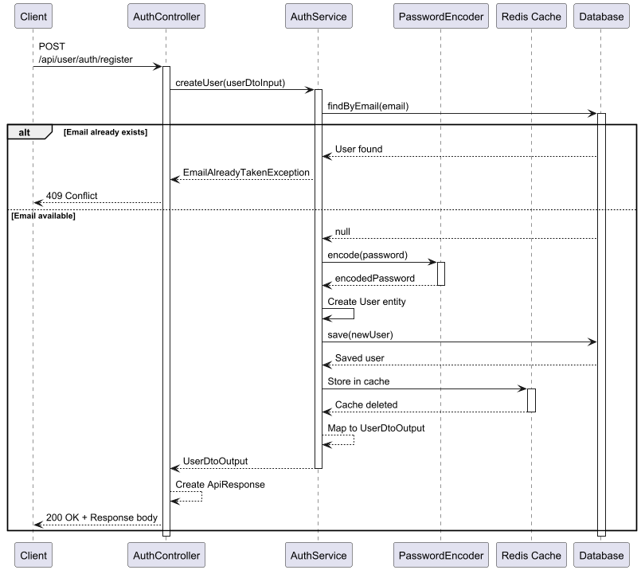
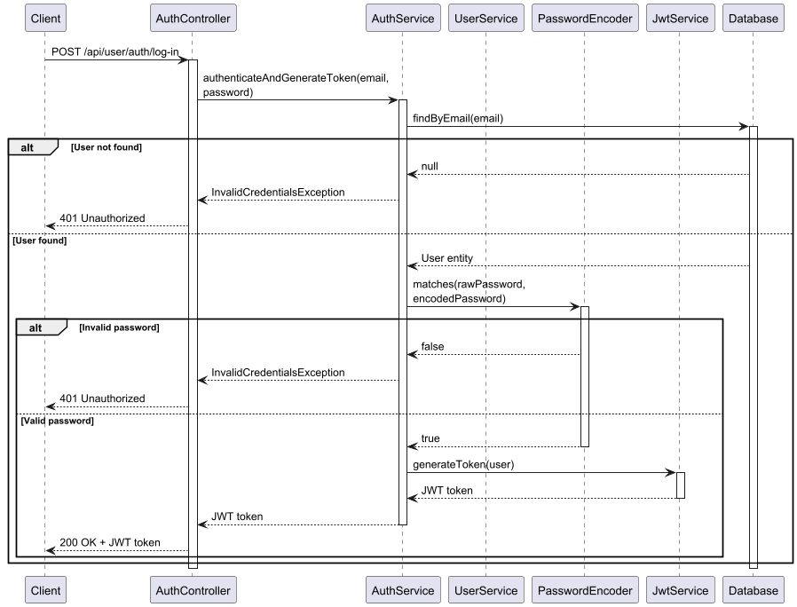
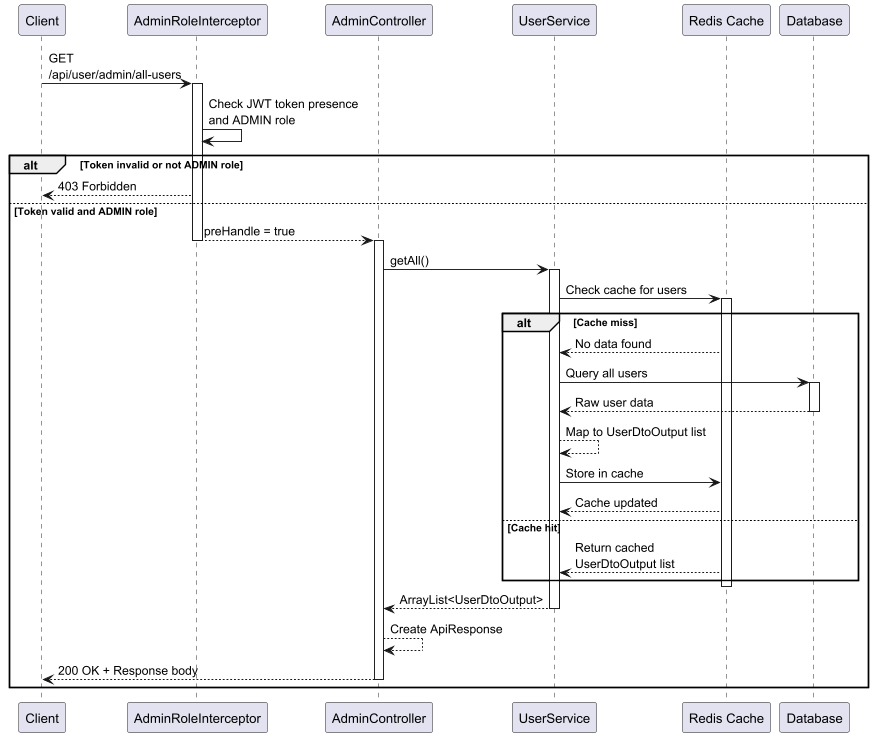
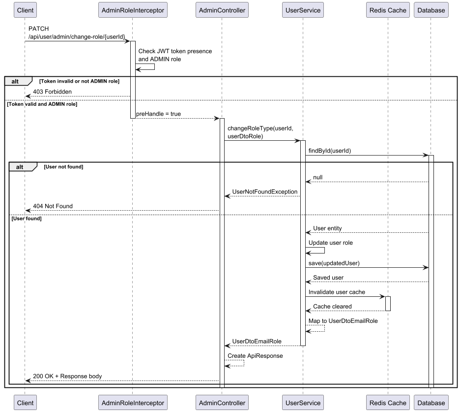
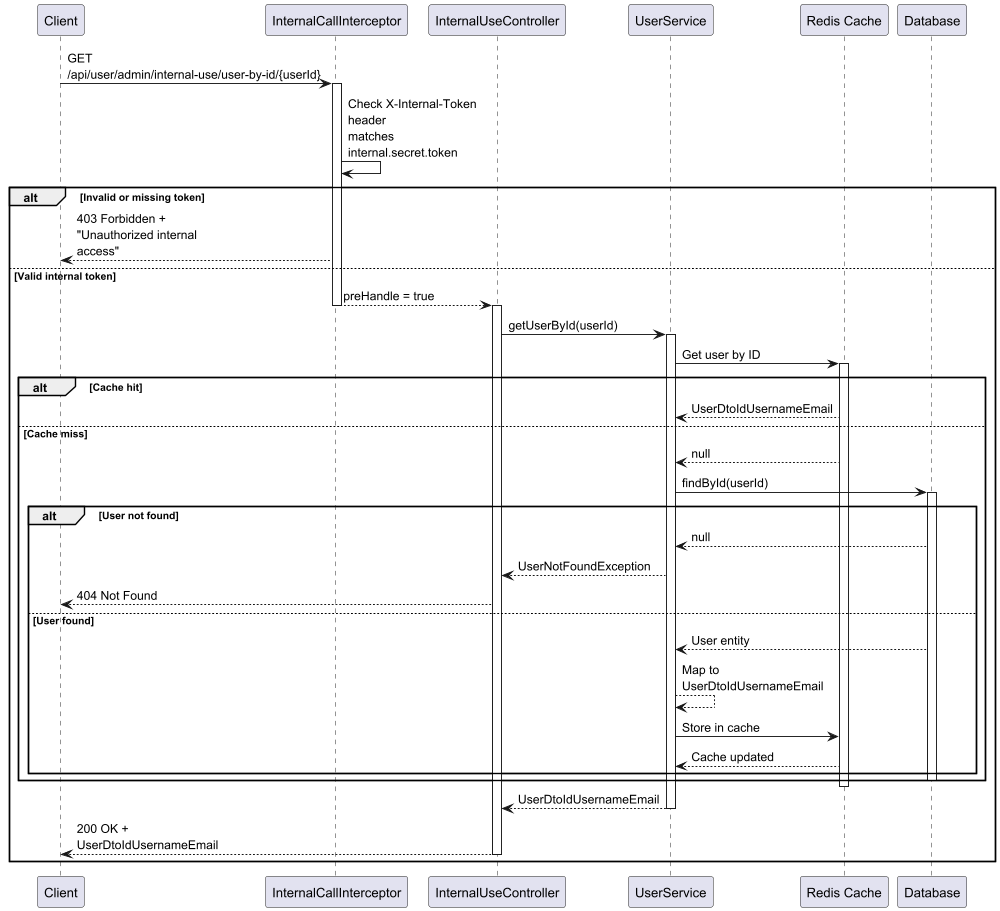
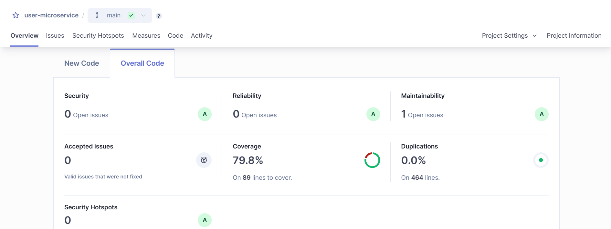

# 🧑‍💼 User Microservice

## 📘 Language Directory

- [English Version](#-user-microservice-english)
- [Versión en Español](#-microservicio-de-usuarios-español)

---

## 🧑‍💼 User Microservice (English)

### 📁 Project Structure

```
user_microservice
├── config
│   └── security (interceptors, Redis and Web MVC configuration)
├── controllers (REST endpoints)
├── dtos (input/output)
├── exceptions (custom error handling)
├── models (entities and enums)
├── repositories (data access)
├── services (interfaces, implementations, and mapping)
├── utils
└── UserMicroserviceApplication.java
```

### 📌 Core Features

- User registration and JWT-based authentication.
- Role management for administrators.
- Internal API access protected by a secret token.
- Token validation through gateway filter.
- Security interceptors based on endpoint type.
- Result caching via Redis.
- Role-based access control.
- External access blocked for internal-only endpoints.

### 🔐 Security

- JWT authentication with secret key.
- Token expiration controlled by `jwt.expiration`.
- Role embedded in JWT and validated in backend.
- Interceptors:
  - `AdminRoleInterceptor`: Grants access to admin routes for `ADMIN` role only.
  - `InternalCallInterceptor`: Requires `X-Internal-Token` header.
- Tokens are also validated at the API Gateway level.

### 📡 API Endpoints

#### 🔑 AuthController (`/api/user/auth`)

##### `POST /register`
- Registers a new user.
- **Body**: `UserDtoInput` (username, email, password)
- **Response**: `201 Created` with `UserDtoOutput`
- **Errors**: `400 Bad Request`



##### `POST /log-in`
- Authenticates user, returns JWT.
- **Body**: `UserDtoEmailPassword`
- **Response**: `200 OK` with JWT
- **Errors**: `401 Unauthorized`



#### 👨‍💼 AdminController (`/api/user/admin`)

##### `GET /all-users`
- Returns all users (ADMIN only).
- **Response**: `200 OK` with list of `UserDtoOutput`
- **Errors**: `403 Forbidden`, `401 Unauthorized`



##### `PATCH /change-role/{userId}`
- Changes user role.
- **Body**: `UserDtoRole`
- **Response**: `200 OK` with `UserDtoEmailRole`
- **Errors**: `404 Not Found`, `403 Forbidden`, `500 Internal Server Error`



#### 🛡️ InternalUseController (`/api/user/admin/internal-use`)

##### `GET /user-by-id/{userId}`
- Returns user basic info. Internal only.
- **Header**: `X-Internal-Token`
- **Response**: `200 OK` with `UserDtoIdUsernameEmail`
- **Errors**: `403 Forbidden`, `404 Not Found`



### 🧪 Profiles

| Profile     | Description                                                              |
|-------------|--------------------------------------------------------------------------|
| `default`   | Shared properties across environments.                                   |
| `dev`       | Uses H2 and auto-creates schema.                                         |
| `init`      | Creates schema and loads data (data.sql).                                |
| `docker`    | Production-ready. Uses PostgreSQL, no auto-creation of schema/data.      |

### 📦 Key Dependencies

- Spring Boot 3.4.4
- Spring Data JPA
- Spring Security + JWT (JJWT)
- Spring Cloud Netflix Eureka (Eureka Client)
- Redis Cache
- H2 & PostgreSQL
- Jacoco + SonarQube

### 🎯 SonarQube – Code Quality



- ✅ Coverage: 79.8%
- ✅ Security Issues: 0
- ✅ Duplications: 0%
- ✅ Maintainability: Grade A

### 🚀 Run Locally

```bash
./mvnw spring-boot:run -Dspring-boot.run.profiles=dev
./mvnw spring-boot:run -Dspring-boot.run.profiles=init
./mvnw spring-boot:run -Dspring-boot.run.profiles=docker
```

### 🐳 Docker or Podman

Ready for deployment on Docker as part of a larger stack (gateway, config-server, etc.). Typically runs alongside Eureka Server and PostgreSQL.

### ✅ Tests and Coverage

Coverage is managed by Jacoco and reported to SonarQube. To run tests, create an `application-test.properties` profile with all necessary environment variables and configurations, and ensure you have a SonarQube container or installation. You can generate reports locally with:

```bash
./mvnw clean verify
# Report in: target/site/jacoco/index.html
```

---

## 🧑‍💼 Microservicio de Usuarios (Español)

### 📁 Estructura del proyecto

```
user_microservice
├── config
│   └── security (interceptores, configuración Redis y Web MVC)
├── controllers (endpoints REST)
├── dtos (input/output)
├── exceptions (manejo de errores customizados)
├── models (entidades y enums)
├── repositories (acceso a datos)
├── services (interfaces, implementaciones y mapeos)
├── utils
└── UserMicroserviceApplication.java
```

### 📌 Funcionalidades principales

- Registro de usuarios y autenticación con JWT.
- Gestión de roles (por administradores).
- Consulta interna protegida por token secreto.
- Validación de tokens desde gateway mediante filtros.
- Interceptores de seguridad aplicados según endpoint.
- Cacheo de resultados con Redis.
- Control de acceso granular por roles.
- Protección contra llamadas externas a endpoints internos.

### 🔐 Seguridad

- Autenticación mediante JWT firmado con clave secreta.
- Expiración configurable para tokens (`jwt.expiration`).
- Roles embebidos en el token y validados en backend.
- Interceptores:
  - `AdminRoleInterceptor`: Permite acceso a endpoints de administración solo si el rol es `ADMIN`.
  - `InternalCallInterceptor`: Requiere header `X-Internal-Token`.
- Validación previa de token también en el API Gateway.

### 📡 Endpoints

### 🧪 Perfiles de ejecución

| Perfil     | Descripción                                                                 |
|------------|-----------------------------------------------------------------------------|
| `default`  | Propiedades generales compartidas.                                          |
| `dev`      | Usa H2 y crea las tablas automáticamente.                                   |
| `init`     | Crea las tablas y carga datos desde `data.sql`.                             |
| `docker`   | Producción: usa PostgreSQL, no crea ni carga datos automáticamente.         |

### 📦 Dependencias destacadas

- Spring Boot 3.4.4
- Spring Data JPA
- Spring Security + JWT (JJWT)
- Spring Cloud Netflix Eureka (Eureka Client)
- Redis Cache
- H2 & PostgreSQL
- Jacoco + SonarQube

### 🎯 SonarQube – Calidad del Código


- ✅ Cobertura: 79.8%
- ✅ Problemas de seguridad: 0
- ✅ Duplicación: 0%
- ✅ Mantenibilidad: A

### 🚀 Ejecución local

Perfil dev: 
```bash
./mvnw spring-boot:run -Dspring-boot.run.profiles=dev
```

Perfil init: 
```bash
./mvnw spring-boot:run -Dspring-boot.run.profiles=init
```

Perfil docker:
```bash
./mvnw spring-boot:run -Dspring-boot.run.profiles=docker
```

### 🐳 Docker o Podman

Este microservicio está listo para correr en entornos Docker como parte de un stack mayor (gateway, config-server, etc.). Usualmente se ejecuta en conjunto con Eureka Server y una base PostgreSQL.
### ✅ Pruebas y cobertura

La cobertura es gestionada por Jacoco y reportada a SonarQube, por lo que si quieres ejecutar los tests, deberás crear un perfil application-test.properties y 
definir todas las variables de entorno y configuraciones, además deberás tener un contenedor de SonarQube o instalarlo. Puedes generar los reportes localmente con:


```bash
./mvnw clean verify
# Reporte en: target/site/jacoco/index.html
```